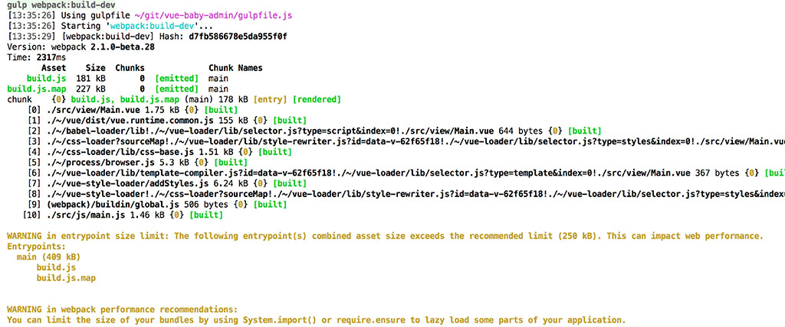
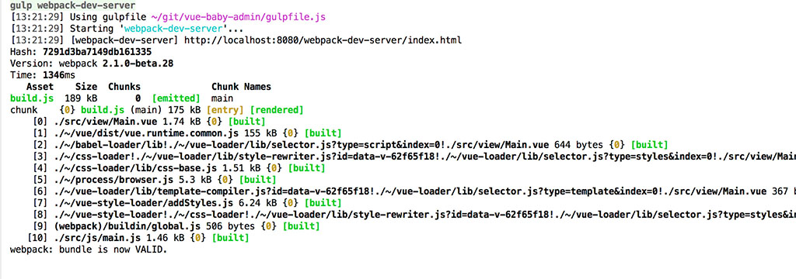

#### gulpfile.js
    
    var gulp = require('gulp')
    var gutil = require("gulp-util");
    var path  = require('path');
    
    // webpack dev server
    var webpackDevServer = require('webpack-dev-server');
    // webpack
    var webpack = require('webpack')
    // webpack 配置
    var webpackConf = require("./webpack.config.js");
    // 修改配置
    var devConf = Object.create(webpackConf);
    
    devConf.devtool = "sourcemap";
    
    // 创建一个配置
    var devCompiler = webpack(devConf);
    
    gulp.task("webpack:build-dev", function(callback) {
        // 运行webpack
        devCompiler.run(function(err, stats) {
            if(err) throw new gutil.PluginError("webpack:build-dev", err);
            gutil.log("[webpack:build-dev]", stats.toString({
                colors: true
            }));
            callback();
        });
    });
    
    // 修改配置
    var serverConf = Object.create(webpackConf);
    serverConf.devtool = "eval";
    
    gulp.task("webpack-dev-server", function(callback) {
        // 启动server
        new webpackDevServer(webpack(serverConf), {
            publicPath: "/" + serverConf.output.publicPath,
            stats: {
                colors: true
            },
            hot:true,
        }).listen(8080, "localhost", function(err) {
            if(err) throw new gutil.PluginError("webpack-dev-server", err);
            gutil.log("[webpack-dev-server]", "http://localhost:8080/webpack-dev-server/index.html");
        });
    });
    
#### gulp webpack运行效果(关于黄色的提示我们在之后的优化会处理webpack打包体积过大的问题)

#### gulp webpack-dev-server 运行效果

