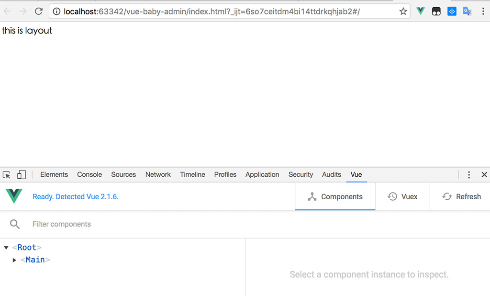

####创建  src/view/Layout.vue
    <template>
        

            <section class="app-main">
                

                    {{msg}}
                    <router-view></router-view>
                

            </section>
        

    </template>
    
    

####创建  src/js/routes.js
    //布局
    import Layout       from '../view/Layout.vue'
    
    
    const routes = [
        { path: '', component: Layout,
            children: [
    
            ]
        },
    ];
    
    export default routes;

####创建  src/js/router.js
    import VueRouter    from  'vue-router'
    
    //挂载vue-router
    Vue.use(VueRouter);
    
    import routes       from  './routes'
    
    //定义路由
    var router = new VueRouter({
        mode: 'hash',
        routes // （缩写）相当于 routes: routes
    })
    
    export default router
    
####更新 src/view/Main.vue
    <template>
        

            //添加路由标签
            <router-view></router-view>
        

    </template>
    
    
    
####编译后 运行结果
